<div align="center">

  <a href="https://www.youtube.com/channel/UCguSCK_j1obMVXvv-DUS3ng">
    
  </a>
  <br><br>

Fixit API services built on NodeJS and Apollo GraphQL.

Author: [Trevor Anderson](https://github.com/trevor-anderson), Founder of [Nerdware](https://github.com/Nerdware-LLC)

[](https://stripe.com/)
&nbsp;
[![graphql][graphql-shield]](https://graphql.org/)
&nbsp;
[![apollo][apollo-shield]](https://www.apollographql.com/)
&nbsp;
[![express][express-shield]](https://expressjs.com/)
&nbsp;
[![pre-commit][pre-commit-shield]](https://github.com/pre-commit/pre-commit)
&nbsp;
[![semantic-release][semantic-shield]](https://github.com/semantic-release/semantic-release)
&nbsp;
[![license][license-shield]](/LICENSE)

[graphql-shield]: https://img.shields.io/badge/GraphQL-E10098.svg?logo=graphql&logoColor=E10098&labelColor=454545
[apollo-shield]: https://img.shields.io/badge/Apollo_Server_v3-311C87.svg?logo=apollo-graphql&labelColor=454545
[express-shield]: https://img.shields.io/badge/Express_v4-7B7B7B.svg?logo=express&logoColor=FFF&labelColor=454545
[pre-commit-shield]: https://img.shields.io/badge/pre--commit-33A532.svg?logo=pre-commit&logoColor=F8B424&labelColor=454545
[semantic-shield]: https://img.shields.io/badge/%20%20%F0%9F%93%A6%F0%9F%9A%80-semantic--release-E10098.svg
[license-shield]: https://img.shields.io/badge/license-Proprietary-000080.svg?labelColor=454545

</div>

- [🗺 Project Layout](#-project-layout)
- [🛣️ API Routes](#️-api-routes)
- [🔐 User Authentication](#-user-authentication)
- [💎 Premium SaaS Products](#-premium-saas-products)
- [🗄️ DynamoDB Database](#️-dynamodb-database)
  - [Fixit-API Access Patterns](#fixit-api-access-patterns)
  - [Single Table Design](#single-table-design)
- [📝 License](#-license)
- [💬 Contact](#-contact)

---

## 🗺 Project Layout

```bash
.
├── docker                          # Dockerfile and docker-compose.yaml
└── src                             # Source code files
    ├── __tests__                   # Jest tests
    ├── events                      # Event emitter and handlers
    ├── graphql                     # GraphQL typedefs and resolvers
    ├── lib                         # Third-party client configs
    │   ├── dynamoDBclient          # AWS SDK DynamoDB and dynamoose client configs
    │   ├── lambdaClient            # AWS SDK Lambda client configs and related utils/types
    │   ├── s3client                # AWS SDK S3 client configuration
    │   └── stripe                  # Stripe client and handlers for Stripe Webhooks
    ├── middleware                  # Middleware functions used by routers/
    ├── models                      # Data-defining classes which implement DynamoDB CRUD operations
    ├── routers                     # Express routers
    ├── server                      # Server init logic and process handlers
    ├── types                       # Ambient Typescript type definitions
    └── utils                       # Utility functions
```

## 🛣️ API Routes

The graph below outlines every available API route and endpoint. Endpoint graph nodes have color-coded outlines indicating the level of authentication required for user access:

```mermaid
flowchart LR
  root("/") --> api("/api \n\n • GraphQL API entrypoint")
  root --> admin("/admin \n\n • CSP reports and \n healthchecks")
  root --> auth("/auth \n\n • User registration and logins \n (administers auth tokens)")
  root --> connect("/connect \n\n • Stripe Connect \n endpoints")
  root --> subs("/subscriptions \n\n • Endpoints for managing \n Fixit subscriptions")
  root --> webhooks("/webhooks \n\n • Webhook endpoints")
  subgraph gql ["ApolloServer GraphQL Endpoints"]
  api
  end
  subgraph express ["Express Endpoints"]
  admin --> csp("/admin/csp-violation \n\n • CSP #quot;report-to#quot;" target)
  admin --> healthcheck("/admin/healthcheck \n\n • Healthchecks target")
  auth --> register("/auth/register \n\n • User registration")
  auth --> login("/auth/login \n\n • User login target. Accepts \n email+pw or Google OAuth")
  auth --> token("/auth/token \n\n • Refreshes auth tokens")
  connect --> accountLink("/connect/account-link \n\n • Creates link to Stripe Connect \n setup for new/existing users")
  connect --> dashboardLink("/connect/dashboard-link \n\n • Creates link to Stripe Dashboard \n for existing users")
  subs --> pay("/subscriptions/submit-payment \n\n • Handles payments for \n Fixit subscriptions")
  subs --> portal("/subscriptions/customer-portal \n\n • Provides subscription \n management portal for users")
  webhooks --> whAccount("/webhooks/account \n\n • Stripe Accounts \n webhooks handler")
  webhooks --> whCustomer("/webhooks/customer \n\n • Stripe Customers \n webhooks handler")
  end

  classDef default fill:#1f2020,stroke:#7aa4c9,stroke-width:1px
  classDef authenticationRequired stroke:#f1ff2e
  classDef authAndSubscriptionRequired stroke:#37ff21,stroke-width:2px
  classDef subgraphArea fill:#474949,color:#e3e3e3

  class token,pay,portal,accountLink,dashboardLink authenticationRequired
  class api authAndSubscriptionRequired
  class express,gql subgraphArea
```

-  Endpoints outlined in <span style="color:#f1ff2e;">yellow</span> require a valid auth token (for more info, see [Fixit-API User Authentication](#-user-authentication))
-  Endpoints outlined in <span style="color:#37ff21;">green</span> require both a valid auth token and an active subscription (for more info, see [Fixit SaaS Products](#-premium-saas-products))



## 🔐 User Authentication

This API uses self-vended [JSON Web Tokens](https://jwt.io/introduction) to manage user authentication and authorization.

<!-- TODO Write more re: API auth mechanisms -->

## 💎 Premium SaaS Products

The table below lists currently available Fixit SaaS products. Subscription management is powered by [Stripe](https://stripe.com/billing).

| Product                 | Purchase Option      | Price (USD) |                Promo Code(s) Available?                |
| :---------------------- | :------------------- | :---------: | :----------------------------------------------------: |
| Fixit SaaS Subscription | 14-Day Free Trial    |     $0      |                          N/A                           |
| Fixit SaaS Subscription | Monthly Subscription |  $5/month   | <span style="color:#66FF00;font-size:1.5rem;">✓</span> |
| Fixit SaaS Subscription | Annual Subscription  |  $50/year   | <span style="color:#66FF00;font-size:1.5rem;">✓</span> |

## 🗄️ DynamoDB Database

<!-- TODO Talk about migrating from MySQL -->

This API uses a single DynamoDB table with primary keys `pk` and `sk`, along with an overloaded `data` index attribute which supports a range of flexible queries using two GSIs: `Overloaded_SK_GSI` and `Overloaded_Data_GSI`.

### Fixit-API Access Patterns

<!-- TODO clean up below commentary re: DynamoDB Access Patterns -->

- **USERS**
  - Find a User by their email for logins and createContact resolver.
  - Find a User by their user ID (Query.user resolver, not sure how much this is used).
  - Find a User by their phone (createNewConnection resolver)
  - Update a User's Subscription by sub ID (stripeCustomerWebhookHandler)
  - Find a User's StripeConnectAccount by its ID (update its details via webhook handler)
  - Find a User's Subscription by its ID
  - Find a User's Profile by its ID
- **PHONE CONTACTS**
  - Find existing Users by phone OR email
- **INVITES**
  - Find an Invite by "receiverPhone" (convertInvitesIntoContacts).
    - In MySQL the searched table was "invites", which stored "receiverPhone".
    - The returned Invite/Invites would be converted into new User Contacts.
- **CONTACTS**
  - Find a Contact by contact ID
  - Find a User's Contacts using their user ID
- **INVOICES**
  - Find an Invoice by ID
  - Find a User's Invoices using their user ID
  - Find a User's Invoices by STATUS
  - Find Invoices wihtin a given date range
- **WORK ORDERS**
  - Find a WorkOrder by ID
  - Find a User's WorkOrders using their user ID
  - Find WorkOrders within a given date range
- **PUSH NOTIFICATIONS**
  <!-- TODO Add PN access patterns -->

<!-- TODO talk more about
  - the DB generally
  - Adjacency Lists design pattern
  - Excellent query patterns
-->

### Single Table Design

| Item                        | `pk`                  | `sk`                                 | `data`                    |
| :-------------------------- | :-------------------- | :----------------------------------- | :------------------------ |
| User                        | USER#\<timestampUUID> | #DATA#\<userID>                      | \<user_email>             |
| User Subscription           | \<userID>             | SUBSCRIPTION#\<userID>#\<timestamp>  | \<stripe_subscriptionID>  |
| User Stripe Connect Account | \<userID>             | STRIPE_CONNECT_ACCOUNT#\<userID>     | \<stripeConnectAccountID> |
| Work Order                  | \<createdBy_userID>   | WO#\<createdBy_userID>#\<timestamp>  | \<assignee_userID>        |
| Invoice                     | \<createdBy_userID>   | INV#\<createdBy_userID>#\<timestamp> | \<assignee_userID>        |
| Contact                     | \<userID>             | CONTACT#\<contact_userID>            | \<contact_userID>         |
| Push Notification           | \<recipient_userID>   | PUSH_RECEIPT#\<userID>#\<timestamp>  | \<pushReceiptID>          |

## 📝 License

All files and/or source code contained herein are for commercial use only by Nerdware, LLC.

See [LICENSE](/LICENSE) for more information.

<div align="center" style="margin-top:35px;">

## 💬 Contact

Trevor Anderson - [@TeeRevTweets](https://twitter.com/teerevtweets) - [Trevor@Nerdware.cloud](mailto:trevor@nerdware.cloud)

  <a href="https://www.youtube.com/channel/UCguSCK_j1obMVXvv-DUS3ng">
    
  </a>
  &nbsp;
  <a href="https://www.linkedin.com/in/meet-trevor-anderson/">
    
  </a>
  &nbsp;
  <a href="https://twitter.com/TeeRevTweets">
    
  </a>
  &nbsp;
  <a href="mailto:trevor@nerdware.cloud">
    
  </a>
  <br><br>

  <a href="https://daremightythings.co/">
    <strong><i>Dare Mighty Things.</i></strong>
  </a>

</div>

<!-- LINKS -->

<!-- [express-shield]: https://img.shields.io/badge/Express-7B7B7B.svg?logo=express&labelColor=gray
[pre-commit-shield]: https://img.shields.io/badge/pre--commit-33A532.svg?logo=pre-commit&logoColor=F8B424&labelColor=gray
[semantic-shield]: https://img.shields.io/badge/%20%20%F0%9F%93%A6%F0%9F%9A%80-semantic--release-E10079.svg
[license-shield]: https://img.shields.io/badge/license-Proprietary-000080.svg?labelColor=gray -->
