  
    

Fixit API services built on NodeJS and Apollo GraphQL.

Author: [Trevor Anderson](https://github.com/trevor-anderson), Solopreneur & Founder of [Nerdware](https://github.com/Nerdware-LLC)

&nbsp;

&nbsp;

&nbsp;
[![graphql][graphql-shield]](https://graphql.org/)
&nbsp;
[![apollo][apollo-shield]](https://www.apollographql.com/)
&nbsp;
[![express][express-shield]](https://expressjs.com/)
&nbsp;
[![pre-commit][pre-commit-shield]](https://github.com/pre-commit/pre-commit)
&nbsp;
[![semantic-release][semantic-shield]](https://github.com/semantic-release/semantic-release)
&nbsp;
[![license][license-shield]](/LICENSE)

- [🗺 Project Layout](#-project-layout)
- [🛣️ API Routes](#️-api-routes)
- [🔐 User Authentication](#-user-authentication)
- [💎 Premium SaaS Products](#-premium-saas-products)
- [🗄️ DynamoDB Database](#️-dynamodb-database)
  - [Fixit-API Access Patterns](#fixit-api-access-patterns)
  - [Single Table Design](#single-table-design)
- [📦 CI/CD Pipeline](#-cicd-pipeline)
  - [GitHub Actions](#github-actions)
  - [Codegen](#codegen)
- [📝 License](#-license)
- [💬 Contact](#-contact)

---

## 🗺 Project Layout

- [**`.github/`**](/.github) &nbsp; &nbsp; &nbsp; &nbsp; &nbsp; &nbsp; &nbsp; &nbsp; &nbsp; &nbsp; &nbsp; &nbsp; GitHub Actions workflows and other GitHub-related files
- [**`docker`**](/docker) &nbsp; &nbsp; &nbsp; &nbsp; &nbsp; &nbsp; &nbsp; &nbsp; &nbsp; &nbsp; &nbsp; &nbsp; &nbsp; &nbsp; API Dockerfile and docker-compose.yaml
- [**`fixit@current.graphql`**](/fixit%40current.graphql) &nbsp; The Fixit API GraphQL schema
- [**`src/`**](/src) &nbsp; &nbsp; &nbsp; &nbsp; &nbsp; &nbsp; &nbsp; &nbsp; &nbsp; &nbsp; &nbsp; &nbsp; &nbsp; &nbsp; &nbsp;&nbsp; Source code files
  - [**`events/`**](/src/events) &nbsp; &nbsp; &nbsp; &nbsp; &nbsp; &nbsp; &nbsp; &nbsp; &nbsp;&nbsp; Event emitter and handlers
  - [**`graphql/`**](/src/graphql) &nbsp; &nbsp; &nbsp; &nbsp; &nbsp; &nbsp; &nbsp; &nbsp;&nbsp; GraphQL typedefs and resolvers
  - [**`lib/`**](/src/lib) &nbsp; &nbsp; &nbsp; &nbsp; &nbsp; &nbsp; &nbsp; &nbsp; &nbsp; &nbsp; &nbsp; &nbsp; Third-party clients and internal cache
  - [**`middleware/`**](/src/middleware) &nbsp; &nbsp; &nbsp; &nbsp; &nbsp; &nbsp; Middleware functions used by routers/
  - [**`models/`**](/src/models) &nbsp; &nbsp; &nbsp; &nbsp; &nbsp; &nbsp; &nbsp; &nbsp; &nbsp;&nbsp; Data-defining classes which implement DB CRUD operations
  - [**`routers/`**](/src/routers) &nbsp; &nbsp; &nbsp; &nbsp; &nbsp; &nbsp; &nbsp; &nbsp;&nbsp; Express routers
  - [**`server/`**](/src/server) &nbsp; &nbsp; &nbsp; &nbsp; &nbsp; &nbsp; &nbsp; &nbsp; &nbsp;&nbsp; Server init logic and process handlers
  - [**`tests/`**](/src/tests/README.md) &nbsp; &nbsp; &nbsp; &nbsp; &nbsp; &nbsp; &nbsp; End-to-end tests and the Vitest setup file
  - [**`types/`**](/src/types) &nbsp; &nbsp; &nbsp; &nbsp; &nbsp; &nbsp; &nbsp; &nbsp; &nbsp; &nbsp;&nbsp; Global type definitions and codegen'd types
  - [**`utils/`**](/src/utils) &nbsp; &nbsp; &nbsp; &nbsp; &nbsp; &nbsp; &nbsp; &nbsp; &nbsp; &nbsp;&nbsp; Utility functions

## 🛣️ API Routes

The graph below outlines every available API route and endpoint. Endpoint graph nodes have color-coded outlines indicating the level of authentication required for user access:

```mermaid
flowchart LR
  root("/api") --> api("/api \n\n • GraphQL API entrypoint")
  root --> admin("/api/admin \n\n • CSP reports and \n healthchecks")
  root --> auth("/api/auth \n\n • User registration and logins \n (administers auth tokens)")
  root --> connect("/api/connect \n\n • Stripe Connect \n endpoints")
  root --> subs("/api/subscriptions \n\n • Endpoints for managing \n Fixit subscriptions")
  root --> webhooks("/api/webhooks \n\n • Webhook endpoints")
  subgraph gql ["ApolloServer GraphQL Endpoints"]
  api
  end
  subgraph express ["Express Endpoints"]
  admin --> csp("/api/admin/csp-violation \n\n • CSP #quot;report-to#quot;" target)
  admin --> healthcheck("/api/admin/healthcheck \n\n • Healthchecks target")
  auth --> register("/api/auth/register \n\n • User registration")
  auth --> login("/api/auth/login \n\n • User login target. Accepts \n email+pw or Google OAuth")
  auth --> token("/api/auth/token \n\n • Refreshes auth tokens")
  connect --> accountLink("/api/connect/account-link \n\n • Creates link to Stripe Connect \n setup for new/existing users")
  connect --> dashboardLink("/api/connect/dashboard-link \n\n • Creates link to Stripe Dashboard \n for existing users")
  subs --> pay("/api/subscriptions/submit-payment \n\n • Handles payments for \n Fixit subscriptions")
  subs --> portal("/api/subscriptions/customer-portal \n\n • Provides subscription \n management portal for users")
  webhooks --> whStripe("/api/webhooks/stripe \n\n • Stripe webhooks handler")
  webhooks --> whCustomer("/api/webhooks/* \n\n • Other webhooks")
  end

  classDef default fill:#1f2020,stroke:#7aa4c9,stroke-width:1px
  classDef authenticationRequired stroke:#f1ff2e
  classDef authAndSubscriptionRequired stroke:#37ff21,stroke-width:2px
  classDef subgraphArea fill:#474949,color:#e3e3e3

  class token,pay,portal,accountLink,dashboardLink authenticationRequired
  class api authAndSubscriptionRequired
  class express,gql subgraphArea
```

-  Endpoints outlined in yellow require a valid auth token (for more info, see [Fixit-API User Authentication](#-user-authentication))
-  Endpoints outlined in green require both a valid auth token and an active subscription (for more info, see [Fixit SaaS Products](#-premium-saas-products))

## 🔐 User Authentication

This API uses self-vended [JSON Web Tokens](https://jwt.io/introduction) to manage user authentication and authorization.

<!-- TODO Write more re: API auth mechanisms -->

## 💎 Premium SaaS Products

The table below lists currently available Fixit SaaS products. Subscription management is powered by [Stripe](https://stripe.com/billing).

| Product                 | Purchase Option      | Price (USD) |                Promo Code(s) Available?                |
| :---------------------- | :------------------- | :---------: | :----------------------------------------------------: |
| Fixit SaaS Subscription | 14-Day Free Trial    |     $0      |                          N/A                           |
| Fixit SaaS Subscription | Monthly Subscription |  $5/month   | ✓ |
| Fixit SaaS Subscription | Annual Subscription  |  $50/year   | ✓ |

## 🗄️ DynamoDB Database

This API uses a single DynamoDB table with primary keys `pk` and `sk`, along with an overloaded `data` index attribute which supports a range of flexible queries using two GSIs: `Overloaded_SK_GSI` and `Overloaded_Data_GSI`.

<!-- TODO Talk about migrating from MySQL (use details/summary elements) -->

### Fixit-API Access Patterns

<!-- TODO add commentary here re: DynamoDB Access Patterns -->

- **USERS**
  - Find a User by their email
  - Find a User by their user ID
  - Find a User by their phone
  - Update a User's Subscription by sub ID
  - Find a User's StripeConnectAccount by its ID
  - Find a User's Subscription by its ID
  - Find a User's Profile by its ID
- **CONTACTS**
  - Find a Contact by contact ID
  - Find a User's Contacts using their user ID
- **INVOICES**
  - Find an Invoice by ID
  - Find a User's Invoices using their user ID
  - Find a User's Invoices by STATUS
  - Find Invoices wihtin a given date range
- **WORK ORDERS**
  - Find a WorkOrder by ID
  - Find a User's WorkOrders using their user ID
  - Find WorkOrders within a given date range

<!-- TODO talk more about
  - the DB generally
  - Adjacency Lists design pattern
  - Excellent query patterns
-->

### Single Table Design

| Item                        | `pk`                  | `sk`                                 | `data`                    |
| :-------------------------- | :-------------------- | :----------------------------------- | :------------------------ |
| User                        | USER#\<timestampUUID> | #DATA#\<userID>                      | \<user_email>             |
| User Subscription           | \<userID>             | SUBSCRIPTION#\<userID>#\<timestamp>  | \<stripe_subscriptionID>  |
| User Stripe Connect Account | \<userID>             | STRIPE_CONNECT_ACCOUNT#\<userID>     | \<stripeConnectAccountID> |
| Work Order                  | \<createdBy_userID>   | WO#\<createdBy_userID>#\<timestamp>  | \<assignee_userID>        |
| Invoice                     | \<createdBy_userID>   | INV#\<createdBy_userID>#\<timestamp> | \<assignee_userID>        |
| Contact                     | \<userID>             | CONTACT#\<contact_userID>            | \<contact_userID>         |
| Push Notification           | \<recipient_userID>   | PUSH_RECEIPT#\<userID>#\<timestamp>  | \<pushReceiptID>          |

## 📦 CI/CD Pipeline

<!-- An outline of this process is below. -->

<!-- TODO Add screenshot image of pipeline_production workflow in action -->

### GitHub Actions

This project's CI/CD pipeline uses GitHub Actions to [test](/.github/workflows/test.yaml), [release](/.github/workflows/release.yaml), and [deploy](/.github/workflows/deploy.yaml) staging and production environments. Both environments are associated with a protected Git branch:

| Environment | Git Branch | Permits `git push` |
| :---------- | :--------: | :----------------: |
| production  |    main    |         NO         |
| staging     |    next    |        YES         |

For each environment, the [CI/CD pipeline workflow](/.github/workflows/cicd_pipeline.yaml) calls three workflows from the [Nerdware reusable-workflows repo](https://github.com/Nerdware-LLC/reusable-action-workflows):

1. [`Node Test`](https://github.com/Nerdware-LLC/reusable-action-workflows/tree/main#node-test) - Runs test suites, adds test and coverage info to PRs, and updates [CodeCov](https://about.codecov.io/).
2. [`Release`](https://github.com/Nerdware-LLC/reusable-action-workflows/tree/main#release) - Creates a new GitHub release using [Semantic Release](https://github.com/semantic-release/semantic-release#readme).
3. [`ECR Image Push`](https://github.com/Nerdware-LLC/reusable-action-workflows/tree/main#ecr-image-push) - Builds a Docker image and pushes it to [Amazon ECR](https://aws.amazon.com/ecr/).

### Codegen

TypeScript types are generated using [GraphQL Code Generator](https://graphql-code-generator.com/) and the [Fixit GraphQL schema](./fixit%40current.graphql). The same generated types are used throughout the entire Fixit stack.

When the [Fixit GraphQL schema](./fixit%40current.graphql) is updated during development, changes are automatically pushed to [Apollo Studio](https://www.apollographql.com/), thereby enabling every component of the stack to use the latest version of the schema (or any particular previous version, if necessary). The schema changes are pulled into other Fixit repos using [Rover GitHub Actions](https://www.apollographql.com/docs/rover/ci-cd/#github-actions), but can also be pulled imperatively using the [Rover CLI](https://www.apollographql.com/docs/rover/).

## 📝 License

All files, scripts, and source code contained herein are for commercial use only by Nerdware, LLC.

See [LICENSE](/LICENSE) for more information.

## 💬 Contact

Trevor Anderson - [@TeeRevTweets](https://twitter.com/teerevtweets) - [Trevor@Nerdware.cloud](mailto:trevor@nerdware.cloud)

  
  &nbsp;
  
  &nbsp;
  
  &nbsp;
  
    

  <a href="https://daremightythings.co/">
    <strong><i>Dare Mighty Things.</i></strong>
  </a>

<!-- LINKS -->

[graphql-shield]: https://img.shields.io/badge/GraphQL-E10098.svg?logo=graphql&logoColor=E10098&labelColor=454545
[apollo-shield]: https://img.shields.io/badge/Apollo_Server_v4-311C87.svg?logo=apollo-graphql&labelColor=454545
[express-shield]: https://img.shields.io/badge/Express_v4-7B7B7B.svg?logo=express&logoColor=FFF&labelColor=454545
[pre-commit-shield]: https://img.shields.io/badge/pre--commit-33A532.svg?logo=pre-commit&logoColor=F8B424&labelColor=454545
[semantic-shield]: https://img.shields.io/badge/%20%20%F0%9F%93%A6%F0%9F%9A%80-semantic--release-E10098.svg
[license-shield]: https://img.shields.io/badge/license-Proprietary-000080.svg?labelColor=454545
