Fixit is a SaaS product that provides users with powerful tools for managing maintenance and repair workflows, including in-app payments powered by [Stripe](https://stripe.com/). This repo is home to the dual-protocol Fixit API – built on NodeJS, ExpressJS, and Apollo GraphQL.

Author: [Trevor Anderson](https://github.com/trevor-anderson), Solopreneur & Founder of [Nerdware](https://github.com/Nerdware-LLC)

&nbsp;
[![Test Workflow][gh-test-badge]](.github/workflows/test.yaml "View Test Workflow")
&nbsp;
[![CodeCov][codecov-badge]](https://codecov.io/gh/Nerdware-LLC/fixit-api "codecov.io: Coverage Report")
&nbsp;
[![GraphQL][graphql-badge]](https://graphql.org/ "graphql.org")
&nbsp;
[![Apollo][apollo-badge]](https://www.apollographql.com/ "apollographql.com")
&nbsp;
[![OpenAPI][open-api-badge]](https://spec.openapis.org/oas/latest.html "spec.openapis.org/oas/latest")
&nbsp;
[![Express][express-badge]](https://expressjs.com/ "expressjs.com")
&nbsp;
[![pre-commit][pre-commit-badge]](https://pre-commit.com "pre-commit.com")
&nbsp;
[![semantic-release][semantic-badge]](https://github.com/semantic-release/semantic-release "github.com: semantic-release")
&nbsp;
[![License: Proprietary][license-badge]](/LICENSE "View License")

<!--   BADGE LINKS   -->

[gh-test-badge]: https://github.com/Nerdware-LLC/fixit-api/actions/workflows/test.yaml/badge.svg?branch=main
[codecov-badge]: https://codecov.io/gh/Nerdware-LLC/fixit-api/graph/badge.svg?token=L6GXTG836B
[graphql-badge]: https://img.shields.io/badge/GraphQL-E10098.svg?logo=graphql&logoColor=E10098&labelColor=454545
[apollo-badge]: https://img.shields.io/badge/Apollo_Server_v4-311C87.svg?logo=apollo-graphql&labelColor=454545
[open-api-badge]: https://img.shields.io/badge/OpenAPI%20v3.1-609531?logo=openapiinitiative&labelColor=454545
[express-badge]: https://img.shields.io/badge/Express_v4-7B7B7B.svg?logo=express&logoColor=FFF&labelColor=454545
[pre-commit-badge]: https://img.shields.io/badge/pre--commit-F8B424.svg?logo=pre-commit&logoColor=F8B424&labelColor=454545
[semantic-badge]: https://img.shields.io/badge/%20%20%F0%9F%93%A6%F0%9F%9A%80-semantic--release-blue.svg
[license-badge]: https://img.shields.io/badge/license-Proprietary-000080.svg?labelColor=454545

 

- [🗺️ Project Overview](#️-project-overview)
- [📖 API Schema](#-api-schema)
  - [REST Endpoints Diagram](#rest-endpoints-diagram)
  - [GraphQL Schema](#graphql-schema)
- [🔐 User Authentication](#-user-authentication)
- [💎 Premium SaaS Products](#-premium-saas-products)
- [🗄️ DynamoDB Database](#️-dynamodb-database)
  - [Fixit-API Access Patterns](#fixit-api-access-patterns)
  - [Single Table Design](#single-table-design)
- [📦 CI/CD Pipeline](#-cicd-pipeline)
  - [GitHub Actions](#github-actions)
  - [Git Workflow](#git-workflow)
  - [Codegen](#codegen)
- [📝 License](#-license)
- [💬 Contact](#-contact)

## 🗺️ Project Overview

The Fixit API provides a robust, scalable, and secure backend for the Fixit SaaS product, which provides users with powerful tools for managing maintenance and repair workflows, including in-app payments powered by [Stripe](https://stripe.com/).

> [!NOTE] Quick Links:
>
> 

>   <a href="https://app.swaggerhub.com/apis/Nerdware/Fixit" title="Check out the REST API OpenAPI Schema on SwaggerHub">
>     

>       
>       <code style="white-space:pre-line;">REST API OpenAPI&#10;Schema Explorer</code>
>     

>   </a>
>   <a href="https://studio.apollographql.com/public/fixit/variant/current" title="Check out the GraphQL API Schema-Explorer on Apollo Studio">
>     

>       
>       <code style="white-space:pre-line;">GraphQL API&#10;Schema Explorer</code>
>     

>   </a>
>   <a href="https://659981450c81cefabec86fa2-hayufvwzje.chromatic.com" title="Check out the Fixit front-end Storybook on Chromatic">
>     

>       
>       <code style="white-space:pre-line;">Fixit Frontend&#10;Component Storybook</code>
>     

>   </a>
>   <a href="https://github.com/Nerdware-LLC/fixit-web#readme" title="Check out the Fixit web app GitHub repo">
>     

>       
>       <code style="white-space:pre-line;">Fixit Web App&#10;GitHub Repo</code>
>     

>   </a>
> 

## 📖 API Schema

<!-- hex color code for 'orange':  #FFA500 -->

This API exposes both **REST** and **GraphQL** endpoints:

<table style="white-space:nowrap">
  <thead>
    <tr>
      <th></th>
      <th style="text-align:center">Schema</th>
      <th style="text-align:center">Framework</th>
      <th>Domain/Purpose</th>
    </tr>
  </thead>
  <tbody>
    <tr style="color:#89EB34">
      <th>REST API</th>
      <td style="text-align:center">
        <a
          href="https://app.swaggerhub.com/apis/Nerdware/Fixit"
          title="Check out the REST API OpenAPI Schema on SwaggerHub"
        >
          View OpenAPI Schema
        </a>
      </td>
      <td style="text-align:center">
        <a href="https://expressjs.com/">ExpressJS</a>
      </td>
      <td style="white-space:normal">
        Handles user authentication, checkout, account management, and webhooks.
      </td>
    </tr>
    <tr style="color:#ec4dbf">
      <th>GraphQL API</th>
      <td style="text-align:center">
        <a
          href="https://studio.apollographql.com/public/fixit/variant/current"
          title="Check out the GraphQL API Schema-Explorer on Apollo Studio"
        >
          View GQL Schema
        </a>
      </td>
      <td style="text-align:center">
        <a href="https://www.apollographql.com/docs/apollo-server/">Apollo Server</a>
      </td>
      <td style="white-space:normal">
        Handles queries and mutations for core items like <code>WorkOrders</code>, <code>Invoices</code>, and <code>Contacts</code>.
      </td>
    </tr>
  </tbody>
</table>

### REST Endpoints Diagram

The below diagram outlines every available REST API endpoint. Endpoint graph nodes have color-coded outlines indicating the level of authentication required for user access:

```mermaid
flowchart LR
  root("/api") --> api("/api \n\n • GraphQL API entrypoint")
  root --> admin("/api/admin \n\n • CSP reports and \n healthchecks")
  root --> auth("/api/auth \n\n • User registration and logins \n (administers auth tokens)")
  root --> connect("/api/connect \n\n • Stripe Connect \n endpoints")
  root --> subs("/api/subscriptions \n\n • Endpoints for managing \n Fixit subscriptions")
  root --> webhooks("/api/webhooks \n\n • Webhook endpoints")
  subgraph gql ["ApolloServer GraphQL Endpoint"]
  api
  end
  subgraph express ["REST Endpoints"]
  admin --> csp("/api/admin/csp-violation \n\n • CSP #quot;report-to#quot;" target)
  admin --> healthcheck("/api/admin/healthcheck \n\n • Healthchecks target")
  auth --> register("/api/auth/register \n\n • User registration")
  auth --> login("/api/auth/login \n\n • User login requests. Accepts \n email+pw or Google OAuth")
  auth --> token("/api/auth/token \n\n • Refreshes auth tokens")
  connect --> accountLink("/api/connect/account-link \n\n • Returns a link to the Stripe-hosted\nConnect onboarding portal")
  connect --> dashboardLink("/api/connect/dashboard-link \n\n • Returns a link to the Stripe-hosted\naccount management portal")
  subs --> promo("/api/subscriptions/check-promo-code \n\n • Validates user promo code inputs")
  subs --> pay("/api/subscriptions/submit-payment \n\n • Handles payments for \n Fixit subscriptions")
  subs --> portal("/api/subscriptions/customer-portal \n\n • Provides subscription \n management portal for users")
  webhooks --> whStripe("/api/webhooks/stripe \n\n • Stripe webhooks handler")
  webhooks --> whCustomer("/api/webhooks/* \n\n • Other webhooks")
  end

  classDef default fill:#1f2020,stroke:#7aa4c9,stroke-width:1px
  classDef authenticationRequired stroke:#f1ff2e
  classDef authAndSubscriptionRequired stroke:#ec4dbf,stroke-width:2px
  classDef subgraphArea fill:#474949,color:#e3e3e3

  class promo,token,pay,portal,accountLink,dashboardLink authenticationRequired
  class api authAndSubscriptionRequired
  class express,gql subgraphArea
```

-  Endpoints outlined in yellow require authentication via auth token (for more info, see [Fixit-API User Authentication](#-user-authentication))
-  Endpoints outlined in pink require both authentication _and_ an active subscription (for more info, see [Fixit SaaS Products](#-premium-saas-products))

### GraphQL Schema

Check out the [Fixit GraphQL Schema Explorer](https://studio.apollographql.com/public/fixit/variant/current) on Apollo Studio. There you'll find excellent tools for exploring the latest version of the Fixit GraphQL schema:

- Documentation for all available objects, queries, mutations, and subscriptions.
- An explorer for trying out operations with mock responses.
- A comprehensive changelog for the schema SDL.

## 🔐 User Authentication

This API uses self-vended [JSON Web Tokens](https://jwt.io/introduction) to manage user authentication and authorization.

<!-- TODO Write more re: API auth mechanisms -->

## 💎 Premium SaaS Products

The table below lists currently available Fixit SaaS products. Subscription management is powered by [Stripe](https://stripe.com/billing).

| Product                 | Purchase Option      | Price (USD) |                Promo Code(s) Available?                |
| :---------------------- | :------------------- | :---------: | :----------------------------------------------------: |
| Fixit SaaS Subscription | 14-Day Free Trial    |     $0      |                          N/A                           |
| Fixit SaaS Subscription | Monthly Subscription |  $5/month   | ✓ |
| Fixit SaaS Subscription | Annual Subscription  |  $50/year   | ✓ |

## 🗄️ DynamoDB Database

This API uses a single DynamoDB table with primary keys `pk` and `sk`, along with an overloaded `data` index attribute which supports a range of flexible queries using two GSIs: `Overloaded_SK_GSI` and `Overloaded_Data_GSI`.

<!-- TODO Talk about migrating from MySQL (use details/summary elements) -->

### Fixit-API Access Patterns

<!-- TODO add commentary here re: DynamoDB Access Patterns -->

- **USERS**
  - Find a User by their email
  - Find a User by their user ID
  - Find a User by their phone
  - Update a User's Subscription by sub ID
  - Find a User's StripeConnectAccount by its ID
  - Find a User's Subscription by its ID
  - Find a User's Profile by its ID
- **CONTACTS**
  - Find a Contact by contact ID
  - Find a User's Contacts using their user ID
- **INVOICES**
  - Find an Invoice by ID
  - Find a User's Invoices using their user ID
  - Find a User's Invoices by STATUS
  - Find Invoices wihtin a given date range
- **WORK ORDERS**
  - Find a WorkOrder by ID
  - Find a User's WorkOrders using their user ID
  - Find WorkOrders within a given date range

<!-- TODO talk more about
  - the DB generally
  - Adjacency Lists design pattern
  - Excellent query patterns
-->

### Single Table Design

| Item                        | `pk`                  | `sk`                                 | `data`                    |
| :-------------------------- | :-------------------- | :----------------------------------- | :------------------------ |
| User                        | USER#\<timestampUUID> | #DATA#\<userID>                      | \<user_email>             |
| User Subscription           | \<userID>             | SUBSCRIPTION#\<userID>#\<timestamp>  | \<stripe_subscriptionID>  |
| User Stripe Connect Account | \<userID>             | STRIPE_CONNECT_ACCOUNT#\<userID>     | \<stripeConnectAccountID> |
| Work Order                  | \<createdBy_userID>   | WO#\<createdBy_userID>#\<timestamp>  | \<assignee_userID>        |
| Invoice                     | \<createdBy_userID>   | INV#\<createdBy_userID>#\<timestamp> | \<assignee_userID>        |
| Contact                     | \<userID>             | CONTACT#\<contact_userID>            | \<contact_userID>         |
| Push Notification           | \<recipient_userID>   | PUSH_RECEIPT#\<userID>#\<timestamp>  | \<pushReceiptID>          |

## 📦 CI/CD Pipeline

<!-- An outline of this process is below. -->

<!-- TODO Add screenshot image of pipeline_production workflow in action -->

### GitHub Actions

This project's CI/CD pipeline uses GitHub Actions to [test](/.github/workflows/test.yaml), [release](/.github/workflows/release.yaml), and [deploy](/.github/workflows/deploy.yaml) code changes.

1. [`Node Test`](https://github.com/Nerdware-LLC/reusable-action-workflows/tree/main#node-test) - Runs test suites, adds test and coverage info to PRs, and updates [CodeCov](https://about.codecov.io/).
2. [`Release`](https://github.com/Nerdware-LLC/reusable-action-workflows/tree/main#release) - Creates a new GitHub release using [Semantic Release](https://github.com/semantic-release/semantic-release#readme).
3. [`ECR Image Push`](https://github.com/Nerdware-LLC/reusable-action-workflows/tree/main#ecr-image-push) - Builds a Docker image and pushes it to [Amazon ECR](https://aws.amazon.com/ecr/).

### Git Workflow

This project uses uses [GitHub Flow](https://guides.github.com/introduction/flow/) to deploy two live environments - staging and production - both of which are associated with a protected Git branch:

| Environment | Git Branch |                   Permits `git push`                   |
| :---------- | :--------: | :----------------------------------------------------: |
| staging     |    next    | ✓ |
| production  |    main    |                           ❌                           |

Project versioning and the [CHANGELOG.md](./CHANGELOG.md) are managed automatically via GitHub Actions and [Semantic Release](https://github.com/semantic-release/semantic-release#readme).

For more information on how new code is integrated and deployed, check out the guide to [CONTRIBUTING](./CONTRIBUTING.md).

### Codegen

TypeScript types are generated using [GraphQL Code Generator](https://graphql-code-generator.com/) and the [Fixit GraphQL schema](./fixit%40current.graphql). The same generated types are used throughout the entire Fixit stack.

When the [Fixit GraphQL schema](./fixit%40current.graphql) is updated during development, changes are automatically pushed to [Apollo Studio](https://www.apollographql.com/), thereby enabling every component in the stack to use the latest version of the schema (or any particular previous version, if necessary). The schema changes are pulled into other Fixit repos using [Rover GitHub Actions](https://www.apollographql.com/docs/rover/ci-cd/#github-actions), but can also be pulled imperatively using the [Rover CLI](https://www.apollographql.com/docs/rover/).

## 📝 License

All files, scripts, and source code contained herein are proprietary use only by Nerdware, LLC.

See [LICENSE](/LICENSE) for more information.

## 💬 Contact

Trevor Anderson — [Trevor@Nerdware.cloud](mailto:trevor@nerdware.cloud) — [@TeeRevTweets](https://twitter.com/teerevtweets)

&emsp;

&emsp;

&emsp;

[**_Dare Mighty Things._**](https://www.youtube.com/watch?v=GO5FwsblpT8)

